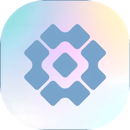
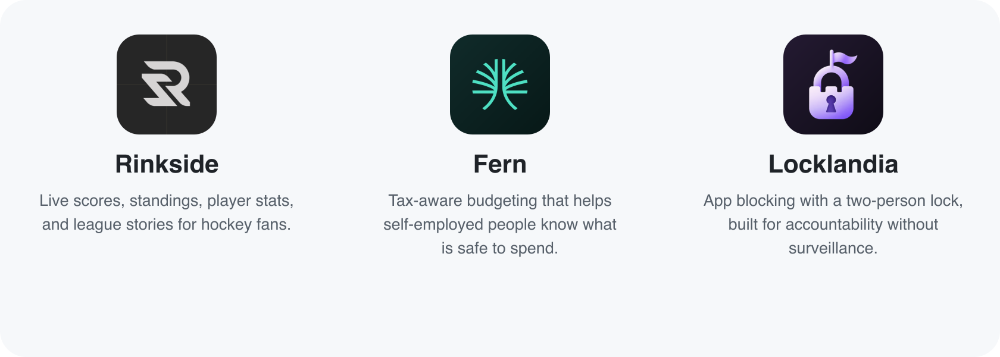

# Jack Patterson

**Product engineer building native tools for AI-powered work.**

I design and ship software end to end, from macOS apps and agent integrations to full-stack platforms. Right now, I’m focused on making multi-agent development feel coherent, local, and dependable.

[JPX Software](https://jpxsoftware.studio) · [Email](mailto:jpatterson@jpdigital.studio)

## Featured work

  

<h3 align="center"><a href="https://github.com/JackTPatterson/octet">Octet</a></h3>

  <strong>A native macOS terminal and workspace for coding agents.</strong> 
  Agent-aware tabs, session recovery, native conversation views, and a shared marketplace over real local processes. 
  Swift · SwiftUI · AppKit · GhosttyKit · Agent tooling

## iOS apps

<picture>
  <source media="(prefers-color-scheme: dark)" srcset="assets/ios-apps-dark.png">
  <source media="(prefers-color-scheme: light)" srcset="assets/ios-apps-light.png">
  
</picture>

  <a href="https://apps.apple.com/us/app/rinkside-hockey-stats/id6762891002">Rinkside on the App Store</a>
  &nbsp;&nbsp;&nbsp;
  <a href="https://apps.apple.com/us/app/fern-self-employed-taxes/id6785351947">Fern on the App Store</a>
  &nbsp;&nbsp;&nbsp;
  <a href="https://github.com/JackTPatterson/Rinkside">Rinkside source</a>

## Other product work

### Assay

A quantitative backtesting and deployment platform built around walk-forward validation and honest performance measurement.

## What I work on

- Native macOS products with thoughtful, keyboard-first interfaces
- AI-agent infrastructure, integrations, and developer experience
- Full-stack product engineering across TypeScript, React, Node.js, and PostgreSQL
- Production systems, CI/CD, platform reliability, and rapid prototyping

## Now

- Building **Octet** in the open
- Leading AI-driven product and platform work at **Go!Foton**
- Taking on select automation and product engagements through [JPX Software](https://jpxsoftware.studio)

If you’re working on developer tools, agent workflows, or ambitious native software, [let’s talk](mailto:jpatterson@jpdigital.studio).
